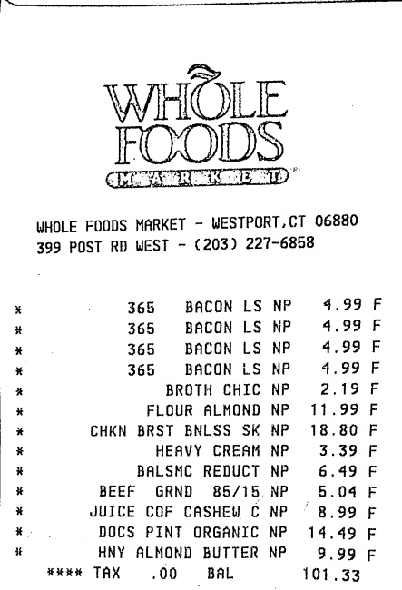

# Django-document-scanner

## Inspiration
I read this blog post. https://www.pyimagesearch.com/2014/09/01/build-kick-ass-mobile-document-scanner-just-5-minutes/
I wanted to use this a service to use to build applications with. The idea is to send the image you want over HTTP and get back the scanned image as a response.

#### Output image

 
  <kbd>
    
  </kbd>

## Setup
I tested this with Python 3. Create your environment and install the packages with `pip install -r requirements.txt`.

## Running
Run with `python manage.py runserver`
With Postman, send a POST,GET,UPDATE,DELETE request with form-data, key is "name" and "ImageFiled" and the value is the "name of image" and  image file.
As a response, you should get the scanned image which get stored in your media folder.

[20161215-160329-largejpg](https://user-images.githubusercontent.com/3746914/31070957-ead279f8-a794-11e7-9c77-33bfb8acab0e.jpg)

## For the flask versionof this check this link  [flask version](https://okoliechykwuka.github.io/portfolio/)
